<div align="center">

# 🔭 go-observatory

**A Go service on gin under a full observability stack — metrics · logs · traces · profiles · browser — in one `docker compose up`, or in Kubernetes.**


[Quick start](#-quick-start) · [Architecture](#-architecture) · [Dashboard](#-dashboard) ·
[Signal to signal](#-from-signal-to-signal) · [Server](#-server) · [Logging](#-logging) ·
[Metrics](#-metrics) · [Profiles](#-profiles) · [Configuration](#-configuration) ·
[Kubernetes](#%EF%B8%8F-kubernetes) · [Development](#-development)

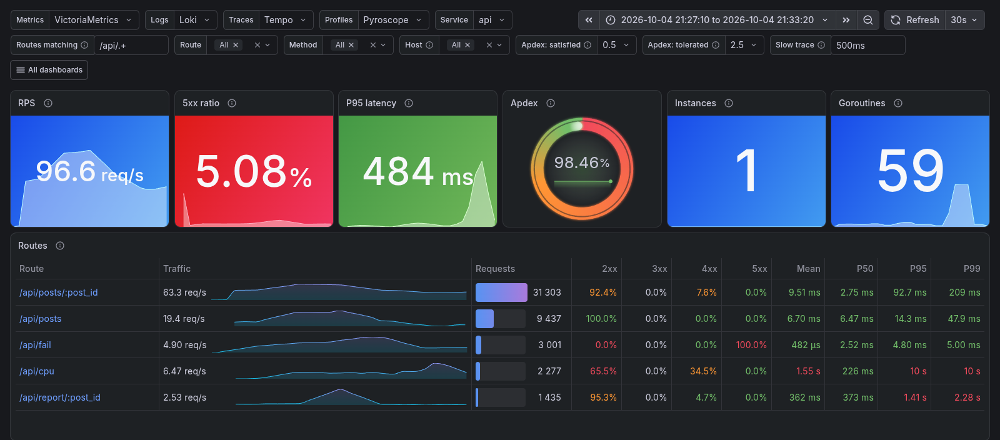

</div>

A gin service and everything that watches it: traces, metrics, logs and profiles of every request,
collected by Alloy and read on one Grafana dashboard. The handlers have no business logic: they only touch
what shows up in Grafana — an in-memory cache, SQLite, an external API
([JSONPlaceholder](https://jsonplaceholder.typicode.com)) and the CPU. One process per instance,
its goroutines over every core Go is given.

## 🚀 Quick start

Needs Docker and [just](https://just.systems); Go only to work on the code — `go.mod` asks for 1.26,
and an older `go` fetches that toolchain itself.

```sh
just dc up     # docker compose up --build -d; just k3d up for Kubernetes
just traffic   # RATE=10 DURATION=60 just traffic
```

Both ways to run it live in [`deploy/`](deploy):
[`compose/docker-compose.yaml`](deploy/compose/docker-compose.yaml) and the Kubernetes manifests in
[`kubernetes/`](deploy/kubernetes). The `just` recipes point Compose at its file; by hand it is
`docker compose -f deploy/compose/docker-compose.yaml …`. The same stack runs in a local Kubernetes
cluster with `just k3d up` — see [Kubernetes](#%EF%B8%8F-kubernetes).

| what | where |
|---|---|
| 🐹 the page and the API | http://localhost:8000 |
| 📊 Grafana, no login | http://localhost:3000 |
| 🔀 Alloy: components, live debugging | http://localhost:12345 |

> [!TIP]
> Every button on the page is a trace that starts in the browser. `just dc down -v` wipes the data;
> `just run` runs the application outside Docker against the running stack.

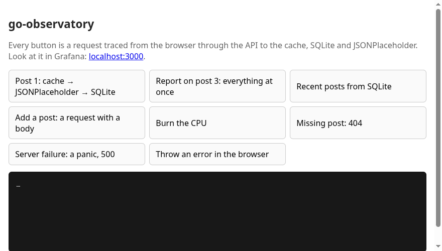

## 🧭 Architecture

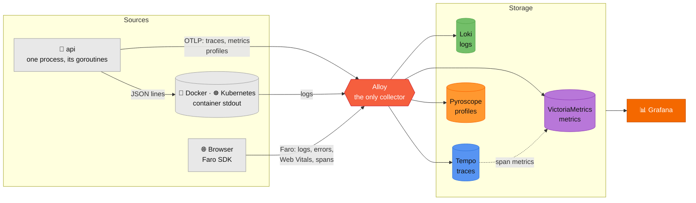

| signal | from the process | through Alloy | stored in |
|---|---|---|---|
| 📈 metrics | OTLP gRPC every 15 s, one `service.instance.id` per process | `otelcol.receiver.otlp` → Prometheus model | VictoriaMetrics, 14 days |
| 📜 logs | one JSON object per line on stdout; the browser's through Faro | `loki.source.docker` or `loki.source.kubernetes` · `faro.receiver`: `lvl` a label, ids structured metadata | Loki |
| 🧵 traces | OTLP gRPC; the browser's through Faro | `otelcol.receiver.otlp` · `faro.receiver` | Tempo, 3 days |
| 🔥 profiles | Pyroscope Go SDK: CPU, memory, goroutines, mutexes, blocking — samples labelled with their span | `pyroscope.receive_http` | Pyroscope |

## 📊 Dashboard

**Go: traffic, latency, errors, traces, logs, profile** — the routes' traffic, latency and errors,
the SLO, the Go runtime, profiles, traces and logs on one dashboard. Nothing hardcoded: data sources, service, routes,
method, host and thresholds are variables. A series on the route, status code and error panels
links to its traces or log lines — click it; a route in the Routes table narrows the whole
dashboard to itself.

| where | variables |
|---|---|
| the top of the dashboard | Metrics · Logs · Traces · Profiles · Service · Routes matching · Route · Method · Host · Apdex satisfied · Apdex tolerated · Slow trace |
| the Status codes row | Status codes — the classes its panel draws, 4xx and 5xx at first |
| the Latency row | Percentiles — P50, P95 and P99, P95 at first |
| the Go runtime row | Percentiles — the same, for the instances' latency and the scheduler's |
| the Profiling row | Profile type — CPU at first, memory, goroutines, mutexes, blocking |
| the Traces row | Show — slow or failed at first, slow, failed or all |
| the Logs row | Levels — DEBUG, INFO, WARNING, ERROR, CRITICAL, all at first |

| group | row | what |
|---|---|---|
| top | | RPS · 5xx ratio · P95 now, with sparklines · Apdex · instances · goroutines · every route with its trend, requests, 2xx, 3xx, 4xx, 5xx, mean, P50, P95 and P99 |
| Requests | Traffic | RPS by route, the total over them and the total yesterday |
| | Status codes | RPS of the classes picked, a total per class and a line per route and code |
| | Latency | the percentiles picked, of the service, yesterday and of each route · the heatmap |
| | Errors | by route and type · each message with its type, route and count — from the log |
| | Payload, collapsed | bytes per second · body size P95 by route, requests dashed and responses solid |
| SLO | | error budget left · burn rate over 1 h and 6 h · requests fast enough — all over 7 days, with sparklines · availability against the objective |
| Runtime | Go runtime | request share against an even split · the percentiles picked, under their total · goroutines, stacked · CPU against GOMAXPROCS · scheduler latency · instance starts |
| | Memory, collapsed | heap used against the GC goal · allocations in bytes and objects per second · GOMAXPROCS and GOGC |
| | Profiling, collapsed | flame graph of the profile type picked |
| Traces & logs | Traces | the traces picked in Show, newest first |
| | Logs | of the levels picked: lines by level · the stream — time, level, status, duration, request and message in columns |

An instance is one process, and Go runs its goroutines on GOMAXPROCS threads at once — every core
it is given. So the CPU panel is in fractions of
GOMAXPROCS, and the scheduler panel shows what comes before it reaches 100%: runnable goroutines
waiting for a thread. Goroutines that only climb are a leak; a heap running past its GC goal again
and again is a collector that cannot keep up.

**In three languages.** English, Русский and 中文 are three dashboards in
[`dashboards/`](observability/grafana/dashboards), each translated whole; a change to one is a
change to all three.

**On grafana.com.** Its upload takes the classic dashboard JSON, not the v2 schema these are in:
[`grafana-com/go-observatory.json`](observability/grafana/grafana-com/go-observatory.json) is the
English one as Grafana itself converts it — `GET /apis/dashboard.grafana.app/v1beta1/…/dashboards/go-observatory`.
The classic schema has no rows inside rows and no row variables, so the rows lie flat and their
pickers join the variables on top; the data sources stay variables, picked on import.

Lines read alike on every panel: a total is thick, over a light fill, named `total`; a thin line
without fill is one route or one instance; a dash is grey for yesterday and white for a reference —
the objective, an even split, the GC goal.

<details open>
<summary><b>Requests</b></summary>

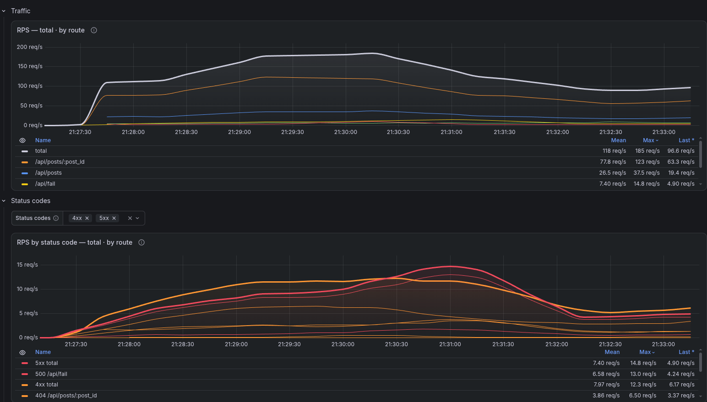
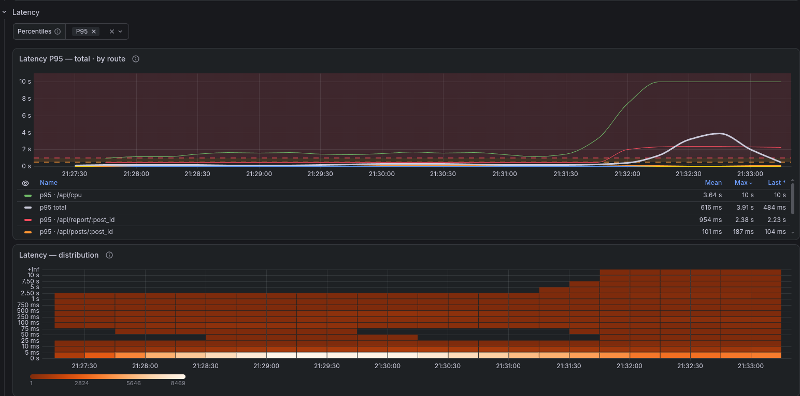
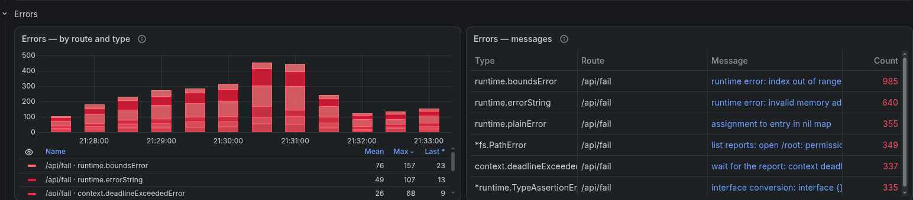
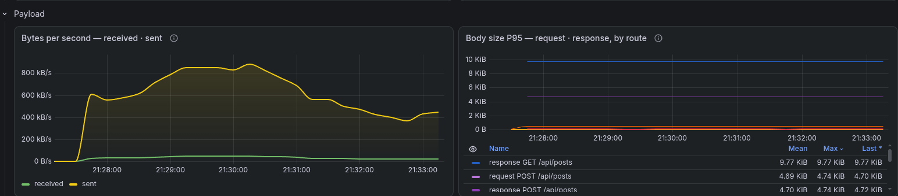
</details>

<details>
<summary><b>SLO</b></summary>

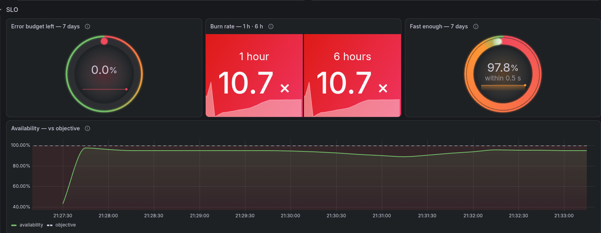
</details>

<details open>
<summary><b>Runtime</b></summary>

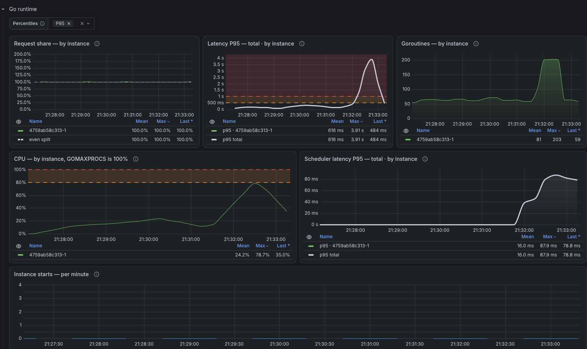
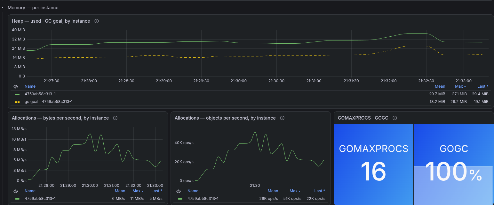
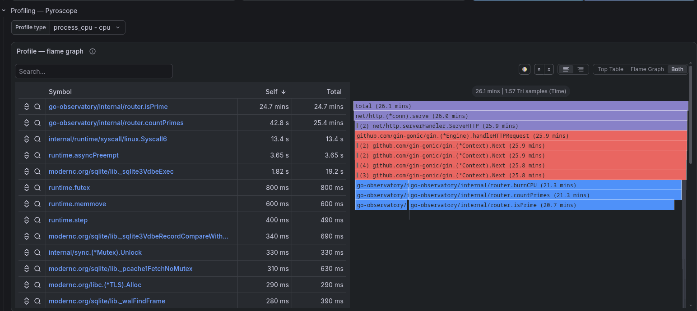
</details>

<details>
<summary><b>Traces & logs</b></summary>

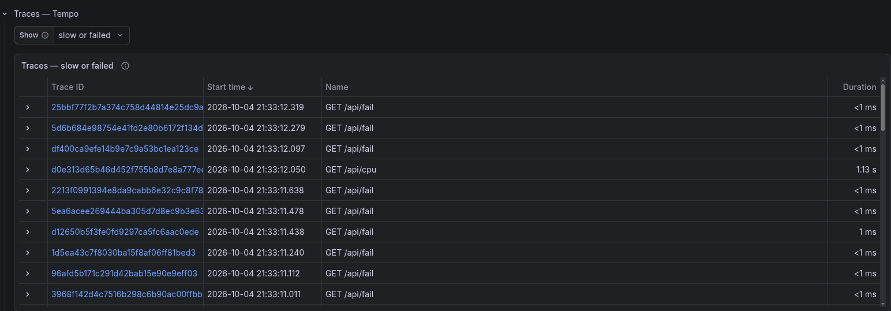
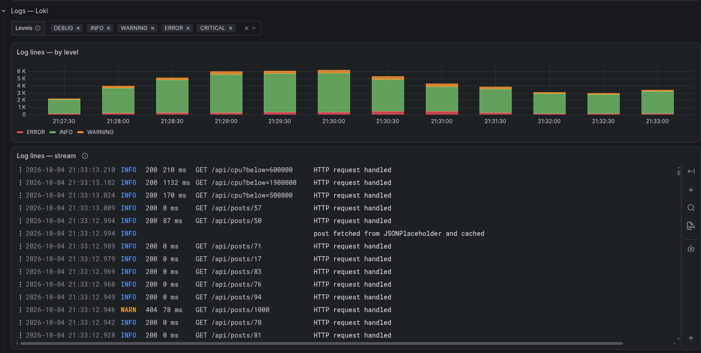
</details>

## 🔗 From signal to signal

| from | to | how |
|---|---|---|
| a log line, the browser's included | its trace · every line of its request | `trace_id` · `request_id` in structured metadata |
| a browser line | every trace of that browser session | `session_id` → `{span.session.id="…"}` |
| a request key from a header or a complaint | its trace | `{span.http.response.header.x_request_id="…"}` |
| a route in the Routes table | the whole dashboard for that route · its traces | `Route` set on the same dashboard · TraceQL with the route |
| a route on the traffic or latency panel | its traces · its slow traces | panel link → TraceQL with the route and the `Slow trace` threshold |
| a status class or a route with its code | the traces with that class · with that code on that route | panel link → TraceQL with the status code |
| an error on a route | its log lines, a panic's with its stack · its traces | panel link → LogQL with `error_type` and `route` · TraceQL with `event.exception.type` |
| a span | its logs · its profile · the rate and P95 of its operation | Tempo data source links |

**① A log line** links its trace and every line of its request. **② The line and its trace**, side
by side — this one started with a click in the page.

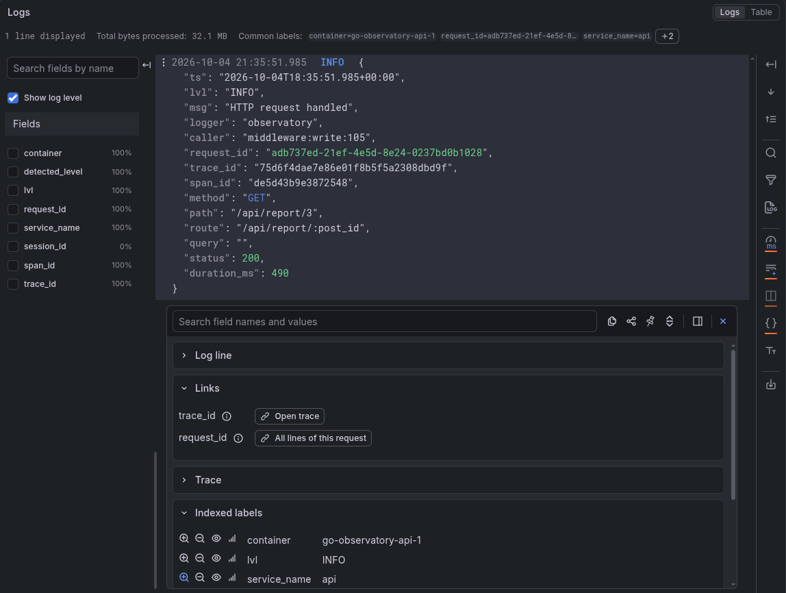
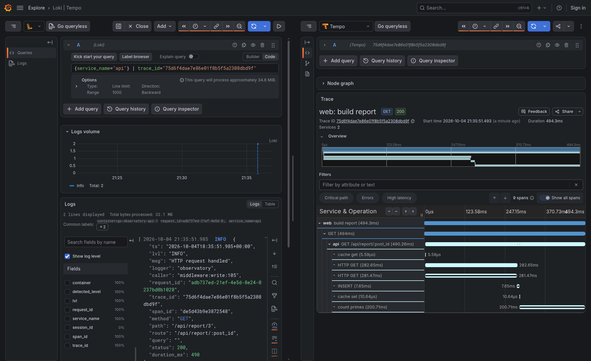

**③ A span** links its logs, its profile and the metrics of its operation. **④ Its profile** is the
CPU of exactly that request: Go labels samples per goroutine, so a span's profile holds its own work
and nothing of the requests beside it — down the middleware chain, otelgin, `Access`, `Recovery`,
`Errors`, to `countPrimes`.

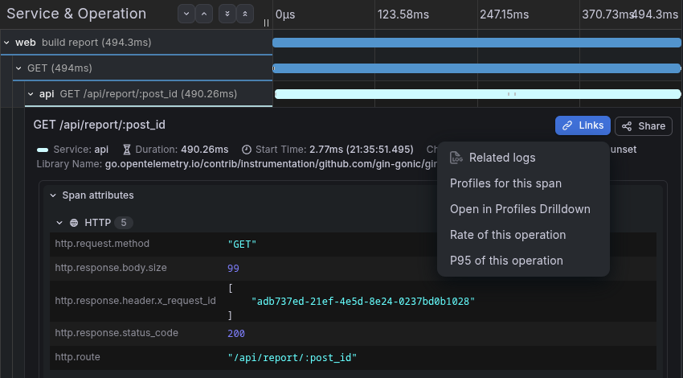
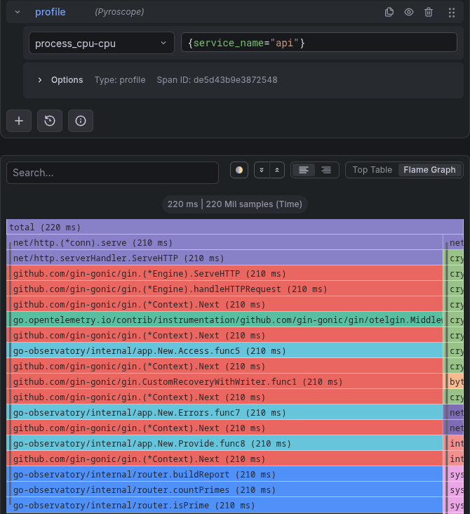

A click on **Report on post 3** is one trace — the browser, the API, the cache, JSONPlaceholder,
SQLite and the CPU work:

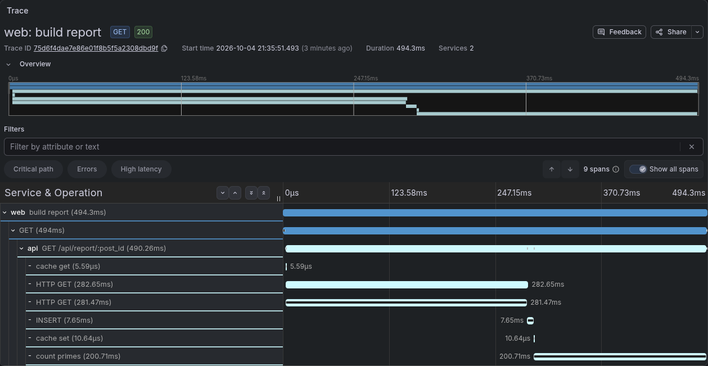

| handler | the trace shows |
|---|---|
| `GET /api/posts/:post_id` | cache → on a miss JSONPlaceholder → `INSERT` → cache |
| `GET /api/posts` | a `SELECT` |
| `POST /api/posts` | an `INSERT` — the only request with a body |
| `GET /api/cpu?below=N` | `count primes` and its profile |
| `GET /api/report/:post_id` | all of the above, the fetches in parallel |
| `GET /api/posts/1000` | a 404 from the source |
| `GET /api/fail?kind=…` | a failure of the kind asked for, each its own Go type — a bug that panics, a 500 with its stack: `index` out of range (`runtime.boundsError`), a `nil` pointer dereferenced (`runtime.errorString`), a type `assertion` that fails (`*runtime.TypeAssertionError`), a write to a nil `map` (`runtime.plainError`); or an error returned: a `timeout` (`context.deadlineExceededError`, a 504), a `permission` refused (`*fs.PathError`, a 500) |
| `GET /api/posts/latest` · `GET /api/cpu?below=` past the limit | a 400: gin's binding refuses the parameter, the handler answers it |
| `DELETE /api/posts/:post_id` | a 405: the route exists, the method does not |

## 💻 Server

One `net/http.Server` per process, gin behind it, built in [`internal/app`](internal/app):

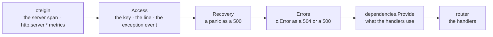

| | |
|---|---|
| timeouts | read header 5 s · read 30 s · write 60 s · idle 2 min |
| stop | SIGINT or SIGTERM: requests in flight get 10 s, then the database closes, then telemetry flushes |
| health | `/health` — neither traced nor logged; the image has no shell, so `api health` asks it |
| image | distroless, static, non-root: no cgo, SQLite is pure Go |

| package | holds |
|---|---|
| [`cmd/api`](cmd/api) | `main`: serves, or `api health` asks a running one |
| [`internal/app`](internal/app) | `New` — telemetry, clients, the database, the middleware and the routes |
| [`internal/config`](internal/config) | `Settings`, read by [env](https://github.com/caarlos0/env) |
| [`internal/enums`](internal/enums) | the closed sets of values read from outside |
| [`internal/cache`](internal/cache) | `MemoryCache`, its reads and writes traced |
| [`internal/database`](internal/database) | SQLite through otelsql |
| [`internal/dependencies`](internal/dependencies) | what the handlers use, through the gin context |
| [`internal/middleware`](internal/middleware) | `Access`, `Recovery`, `Errors` |
| [`internal/observability`](internal/observability) | `ConfigureTracing`, `ConfigureMetrics`, `ConfigureProfiling`, `ConfigureLogging` |
| [`internal/router`](internal/router) | the handlers |
| [`web`](web) | the page and its static files, built into the binary |

## 📜 Logging

```json
{"ts":"2026-10-04T17:58:37.211+00:00","lvl":"INFO","msg":"HTTP request handled","logger":"observatory","caller":"middleware:write:105","request_id":"97e5befa-9329-4b8f-a4a6-96221e9e52f8","trace_id":"5d04993f…","span_id":"…","method":"GET","path":"/api/posts/3","route":"/api/posts/:post_id","query":"","status":200,"duration_ms":2}
```

One JSON line per record from `log/slog`: a handler stamps every record with `caller`, the request
key and the current trace and span — empty outside a request. The levels are `DEBUG`, `INFO`,
`WARNING`, `ERROR` and `CRITICAL`, a Loki label and the dashboard's picker. The access line's level follows the status: `INFO`, `WARNING` for a 4xx,
`ERROR` for a 5xx.

A failure is one of two things. What can fail — I/O, a deadline, a parse — returns an
error: the handler answers what it expects itself (a 400, a 404) and hands the rest to `c.Error`,
wrapped in what it was doing, `list reports: open /root: permission denied`; the `Errors`
middleware picks the status, a 504 for a deadline and a 500 for anything else, and never sends the
error to the client. A bug panics: `Recovery` turns it into a 500, and only a panic has a stack.
Either way the line gets `error_type` and `error_message`, a panic `error_stack` as well. The type
is the one [`semconv.ErrorType`](https://pkg.go.dev/go.opentelemetry.io/otel/semconv/v1.43.0#ErrorType)
gives otelgin for `error.type` on the metrics — through the `fmt.Errorf` wrappers, a panic by the
value it panicked with — and `exception.type` on the span, so a log line, a series and a trace name
a failure alike.

## 📈 Metrics

The process ships only the server's and its own metrics: one view keeps `http.server.*`,
`process.*` and `go.*` and drops the rest.

| metric | from | its own labels |
|---|---|---|
| `http_server_request_duration_seconds` | otelgin | `http_route`, `http_request_method`, `http_response_status_code`, `error_type`, `network_protocol_*`, `server_*`, `url_scheme` |
| `http_server_request_body_size_bytes`, `http_server_response_body_size_bytes` | otelgin | as the duration |
| `go_memory_used_bytes`, `go_memory_gc_goal_bytes`, `go_memory_allocated_bytes_total`, `go_memory_allocations_total`, `go_goroutine_count`, `go_processor_limit`, `go_config_gogc_percent` | the runtime instrumentation | — |
| `go_schedule_duration_seconds` | the runtime's own histogram, through a metric producer | — |
| `process_cpu_time_seconds_total` | the host instrumentation, its `system.*` dropped | `state` |
| `traces_spanmetrics_calls_total`, `traces_spanmetrics_latency` | Tempo, from spans of both services | `service`, `span_name`, `span_kind`, `status_code`, … |
| `traces_service_graph_request_*` | Alloy, from span pairs | `client`, `server`, `connection_type`, `failed` |

Labels on every series are the resource's: `job` from `service.name`,
`instance` from `service.instance.id` — `<host>-<pid>` — and the rest in `target_info`.

## 🔥 Profiles

| profile type | what it shows |
|---|---|
| `process_cpu` | where the CPU goes — `count primes` the widest |
| `memory` alloc · inuse | who allocates, who holds |
| `goroutines` | where goroutines stand |
| `mutex` · `block` | who waits on a lock or a channel |

`otel-profiling-go` wraps the tracer provider: a span started on a goroutine labels the samples
taken there with its id, so **Profiles for this span** on a trace shows exactly that request's work.

## 🔧 Configuration

Environment variables with the `OBSERVATORY__` prefix; groups nest with `__`.

| variable | default |
|---|---|
| `OBSERVATORY__SERVER__HOST` · `PORT` | `127.0.0.1` · `8000` |
| `OBSERVATORY__LOG_LEVEL` | `info` |
| `OBSERVATORY__DB__PATH` | `observatory.db` |
| `OBSERVATORY__OBS__SERVICE_NAME` · `ENVIRONMENT` | `api` · `development` — or `production`, `staging`, `test` |
| `OBSERVATORY__OBS__OTLP__ENDPOINT` | `http://localhost:4317` |
| `OBSERVATORY__OBS__PYROSCOPE__URL` | `http://localhost:4040` |
| `OBSERVATORY__OBS__FARO__COLLECTOR_URL` | `http://localhost:12347/collect` — as the browser sees it |

Go's own `GOMAXPROCS`, `GOGC` and `GOMEMLIMIT` work as anywhere; the Memory row shows what the
process runs with.

## ☸️ Kubernetes

`just k3d up` runs the same stack in a local [k3d](https://k3d.io) cluster: it builds the image,
imports it, applies [`deploy/kubernetes/`](deploy/kubernetes) and waits for the rollout; `just k3d
down` deletes the cluster. The API runs two pods, one process each.

## 🧰 Development

`just` is the command line: a command, then what it acts on; `just` alone lists the commands.

| command | does |
|---|---|
| `just install` · `just hooks` | the modules · git hooks via prek |
| `just lint` | every check — what CI would run |
| `just lint golangci` · `fmt` · `tidy` | golangci-lint · gofumpt and gci · `go mod tidy -diff` |
| `just test` | the tests |
| `just dc up` · `down` · `ps` · `logs` | the stack in Compose; `just docker-compose …` is the same |
| `just k3d up` · `down` · `ps` · `logs` | the stack in a k3d cluster |
| `just traffic` | requests at the running stack: `RATE`, `DURATION`, and the mix — `CPU_PERCENT`, `REPORT_PERCENT`, `CPU_BELOW_MAX`, `FAIL_PERCENT`, `INVALID_PERCENT` |
| `just run` | the application outside Docker, against the running stack |

| for | library |
|---|---|
| settings | [env](https://github.com/caarlos0/env) |
| HTTP server | [gin](https://github.com/gin-gonic/gin) |
| validation | gin's binding, on [validator](https://github.com/go-playground/validator) |
| HTTP client | `net/http` |
| SQLite | `database/sql` + [modernc.org/sqlite](https://gitlab.com/cznic/sqlite), traced by [otelsql](https://github.com/XSAM/otelsql) |
| logs | `log/slog` |
| request keys | [google/uuid](https://github.com/google/uuid) |
| lint | [golangci-lint](https://golangci-lint.run) — gofumpt, gci and a strict set of linters |

## 🧱 Stack

| | version | port | role |
|---|---|---|---|
| **Grafana** | 13.2.3 | `3000` | dashboards, Explore, Drilldown |
| **Alloy** | 1.20.1 | `12345` · `12347` | the only collector · the Faro receiver |
| **VictoriaMetrics** | 1.153.0 | `8428` | metrics |
| **Loki** | 3.7.8 | `3100` | logs |
| **Tempo** | 3.1.0 | `3200` | traces, span metrics |
| **Pyroscope** | 2.3.1 | `4040` | profiles |
| **Faro Web SDK** | 2.12.1 | — | the browser's telemetry |
| **Go** · **gin** | 1.26 · 1.12 | `8000` | the service |

Everything is published on `127.0.0.1` only.
